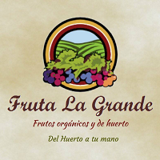

  MARJET PLACE FRUTA LA GRANDE 

## ¿Qué es Fruta La Grande?
Fruta La Grande un emprendimiento dedicado a la venta de frutas orgánicas con calidad y excelente precio.

Trababajan bajo la modalidad 'delivery' y llevan sus productos a distintos puntos de la capittal.

## Fundamentación / Presupuesto 

Para el presente proyecto decidimos usar las siguientes herramientas:

|Etapa de proceso design thinking|Actividad|Descripción|Puntos|
|:----|:----|:---|:---:|
|Descubrimiento e investigación|Entrevistas con cliente|Realización de entrevistas con el cliente (dueño del reto) y establecimiento de sus metas y objetivos.|25|
|Descubrimiento e investigación|Benchmark| Revisión de features de la competencia y referencias análogas. | 20 |
|Descubrimiento e investigación|Entrevistas con usuarios| Entrevistas en profundidad con al menos 5 usuarios. | 60 
|Síntesis y definición|Flujo / árbol de contenidos|Documento que estructura contenidos y su navegación|15|
|Prototipado|Sketching y wireframing| Elaboración de prototipos de baja y mediana fidelidad. | 30 |
|Prototipado|Prototipado de alta fidelidad| Elaboración de prototipo en base a las pantallas diseñadas. | 80 |
|Testeo con usuarios|Testeos de prototipos| Sesiones de testing de la solución propuesta con al menos 5 usuarios. | 60 |

## **Descubrimiento e investigación** 
###  Antecedentes

De acuerdo a la Sociedad Peruana de Gastronomía (Apega), el consumo de productos orgánicos se ha incrementado en un 70% durante los últimos 10 años. Esta demando ha aumentado la oferta, por ello a la tradicional bioferia de Miraflores se han sumado otras ferias distritales y emprendimientos como **Fruta La Grande**.  

Estos últimos resultan importantes, porque según un informe de la revista Semana Económica, el valor económico de una canasta alimentaria de una tienda orgánica es un 73% mayor que una comprada en supermercado, y 48% mayor que una comprada en una bioferia. Y en términos generales una canasta alimntaria orgánica comprada en una tienda es 19% más cara que una comprada en una bioferia. (https://bit.ly/2nY2KjL) 

Teniendo en cuenta que no muchas de las tiendas no ofrecen servicio de delivery gratuito y y que las bioferias requieren que el usuario se desplace, este contexto favorece a nuestro cliete. 

### Entrevista con clientes
* Guía de preguntas

* Conclusiones

### Entrevista con usuarios

### Problemas identificados en la investigación (del cliente y del usuario)

### Benchmark

## Síntesis de definición

### Flujo árbol de contenidos 

### Definición del público objetivo

    * User persona

    * Customer Journey Map (indicando pain y gain points)

### Definición de la solución/producto

## **Ideación**

## **Prototipado**

### Sketching y wireframing

### Link a prototipo navegable 

### Prototipado de alta fidelidad

## **Testeo con usuarios**

### Testeo de prototipos

==============================

* Explicación de cómo los contenidos y funcionalidades responden a los objetivos
  del proyecto. 

* Explicación de cómo los contenidos y funcionalidades resuelven cada uno de las
  necesidades del usuario final.

* Link de Zeplin, InVision inspects o Marvel Hand-offs para compartir tus
  diseños con desarrolladores.

Un video en Loom de máximo 10 minutos explicando tu documento.
* Estos 10 minutos tienes que utilizarlos para explicar los puntos indicados en
  el `README.md` y para hacer un demo de la solución.

* Otros 
En las otras carpetas del repositorio o en las carpetas de Google Drive podrás
agregar los documentos complementarios que sustenten tu proceso:

* Fotos, videos, guías de las actividades que realizaste
* Flujo de usuario
* Mapa de sitio
* Etc